# Syntax Pitfalls — Common Mistakes to Avoid

Quick reference for avoiding the most frequent Mermaid render failures. Consult this alongside diagram type references.

---

## 1. Unquoted Special Characters (THE #1 FAILURE)

Any label containing parentheses, @, /, <, >, :, commas, or pipes must be wrapped in double quotes. The parser will fail if these characters are found naked in node definitions.

❌ Bad:
```mermaid
flowchart TD
    A[Send to user (optional)] --> B{Check auth@domain}
```

✅ Good:
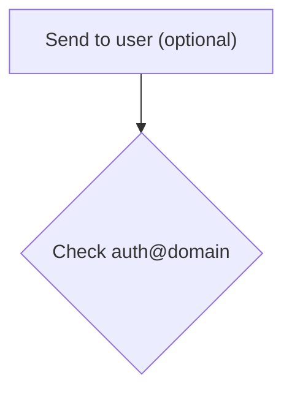

## 2. HTML Tags in Labels

Most HTML tags render inconsistently or crash the parser. Only `<br>` is reliably safe for line breaks across most diagram types (see Section 9 for the full compatibility matrix). Always wrap labels containing `<br>` in double quotes. Prefer `<br>` over `<br/>` — the self-closing form fails in some contexts (e.g., timeline event details).

❌ Bad:
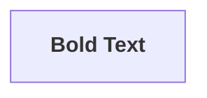

✅ Good:
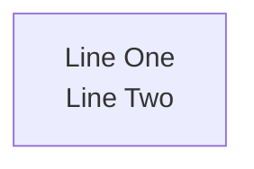

## 3. Long Labels Cause Overflow

Lengthy function signatures or descriptions in node labels cause overflow or truncation. Keep labels under 60 characters and move detail to notes.

❌ Bad:
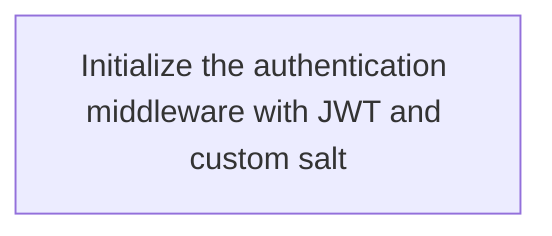

✅ Good:
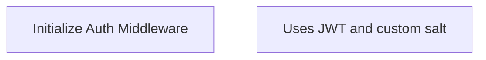

## 4. Stray Semicolons

Legacy Mermaid examples use semicolons after each line. While `graph` might tolerate them, they cause errors in modern diagram types. Omit them entirely.

❌ Bad:
```mermaid
sequence diagram;
    Alice->>Bob: Hello;
```

✅ Good:
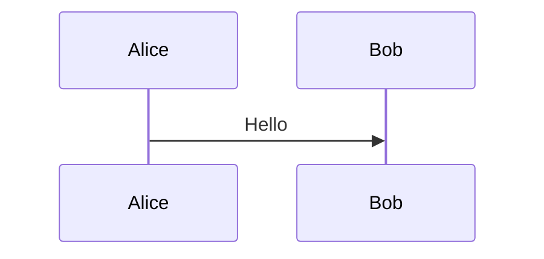

## 5. Mixing graph and flowchart

`graph` is legacy syntax while `flowchart` is modern, supporting subgraph direction and more shapes. Never mix them in the same block. Use `flowchart` by default.

❌ Bad:
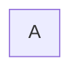

✅ Good:


## 6. Unescaped end as Label Text

`end` is a reserved keyword for closing blocks. A node whose entire label is `end` will be parsed as a block terminator, breaking the diagram.

❌ Bad:
```mermaid
flowchart TD
    A --> end
```

✅ Good:
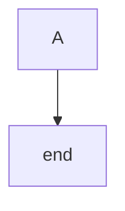

## 7. Overly Dense Diagrams

Diagrams with more than 20 nodes often produce unreadable spaghetti layouts. Split complex logic into multiple diagrams or use subgraphs to group related nodes.

## 8. Mixing Diagram Type Syntax

Each block must use exactly one grammar. Don't blend flowchart arrows with class diagram relationships or sequence diagram syntax.

❌ Bad:
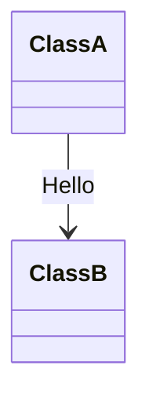

✅ Good:
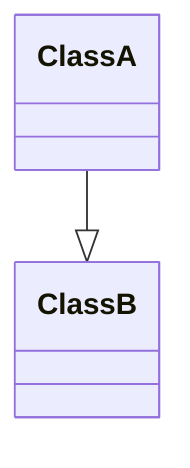

## 9. Line Breaks in Labels — `<br>` Compatibility Matrix

The literal `\n` character **never** creates line breaks in any Mermaid diagram type. It always renders as the literal text `\n`. Use `<br>` (preferred) or `<br/>` inside double-quoted labels instead — but support varies by diagram type.

### Compatibility Matrix

| Diagram Type | Node/State Labels | Edge/Relationship Labels | Notes/Descriptions |
|---|---|---|---|
| **Flowchart** | ✅ `<br>` `<br/>` | ✅ `<br>` `<br/>` | N/A |
| **Sequence** | ✅ `<br>` `<br/>` (participant names) | ✅ `<br>` `<br/>` (messages) | ✅ `<br>` |
| **State** | ✅ `<br>` `<br/>` | ✅ `<br>` | N/A |
| **Class** | ❌ No line breaks in members | ✅ `<br>` (relationship labels only) | N/A |
| **ER** | N/A (attributes are rows) | ⚠️ Inconsistent — works in mmdc CLI, fails in IntelliJ | N/A |
| **C4** | ✅ `<br>` `<br/>` (descriptions) | ✅ `<br>` `<br/>` | N/A |
| **Mindmap** | ✅ `<br>` `<br/>` | N/A | N/A |
| **Timeline** | ✅ `<br>` (section names, event details) | N/A | ⚠️ `<br/>` fails in event details |
| **Sankey** | ❌ No line breaks | ❌ No line breaks | N/A |

### Key Rules

1. **Always use `<br>` over `<br/>`** — `<br>` works everywhere that supports line breaks. `<br/>` fails in some edge cases (e.g., timeline event details).
2. **Always wrap labels containing `<br>` in double quotes** — e.g., `["Line One<br>Line Two"]`.
3. **`\n` never works** — it renders as literal text in every diagram type.
4. **Class diagram members cannot have line breaks** — split long signatures across multiple methods or use abbreviations.
5. **Sankey labels cannot have line breaks** — keep labels short; use abbreviations.

### Examples

❌ Bad (`\n` — never works):


✅ Good (`<br>` — works in flowchart):


⚠️ Class diagram members — no line break support:
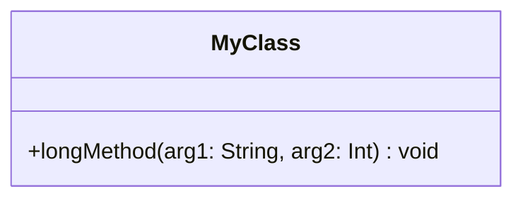
Keep signatures concise. Line breaks render as literal `<br>` text inside class members.

## 10. Missing end Keywords

Every subgraph, alt, loop, opt, par, critical, break, rect, and box block requires a corresponding `end`. Nested blocks are especially prone to missing terminators.

❌ Bad:
```mermaid
flowchart TD
    subgraph Outer
    subgraph Inner
    A
    end
```

✅ Good:
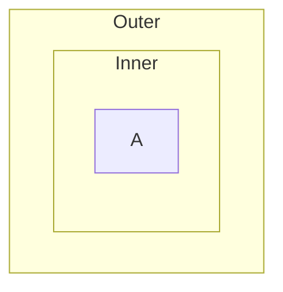

## Quick Rule

> **When in doubt, quote the label.** `["My label"]` is always safer than `[My label]`.
