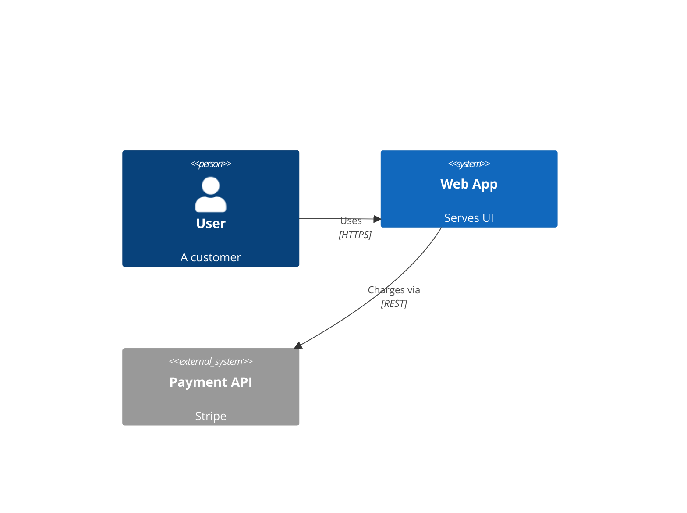
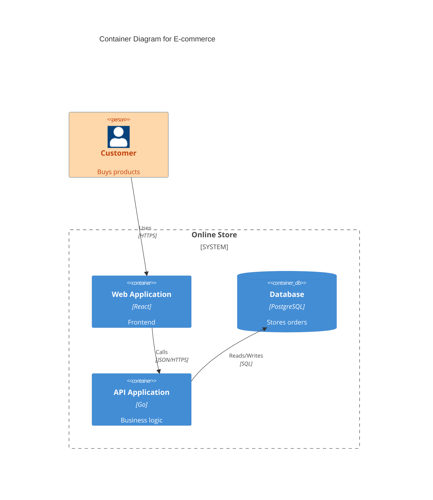

# C4 Diagram

## When to Use
- High-level system architecture and context maps.
- Presenting the "Big Picture" to both technical and non-technical stakeholders.
- Mapping relationships between people, systems, and containers.

## Syntax Reference

### Basic Example

### Extended Example (with styling)

## All Supported Syntax

- **Keywords**: `C4Context`, `C4Container`, `C4Component`.
- **Element Macros**:
    - `Person(alias, label, [descr], [sprite], [tags])`
    - `System(alias, label, [descr], [sprite], [tags])`
    - `System_Ext(alias, label, [descr], [sprite], [tags])`
    - `Container(alias, label, technology, [descr], [sprite], [tags])`
    - `Container_Ext(alias, label, technology, [descr], [sprite], [tags])`
    - `Component(alias, label, technology, [descr], [sprite], [tags])`
    - `Component_Ext(alias, label, technology, [descr], [sprite], [tags])`
    - `SystemDb(alias, label, [descr], [sprite], [tags])`
    - `ContainerDb(alias, label, technology, [descr], [sprite], [tags])`
- **Boundary Macros**: `Boundary(alias, label, [type], [tags])`, `System_Boundary`, `Enterprise_Boundary`, `Container_Boundary`.
- **Relationship Macros**: `Rel(from, to, label, [techn], [descr], [sprite], [tags])`, `BiRel`, `Rel_Back`.
- **Styling Macros**: `UpdateElementStyle(alias, $bgColor, $fontColor, ...)`, `UpdateRelStyle(from, to, $textColor, $lineColor, ...)`.

## Layout Tips (type-specific)
- Use `System_Boundary` or `Container_Boundary` to visually group related internal elements.
- Keep external systems (`System_Ext`) at the periphery to minimize line crossings.
- Use `Rel` description and technology parameters to clarify communication protocols.
- **Line breaks**: Use ` ` in description parameters of element macros (e.g., `Person(alias, "Label", "Line 1 Line 2")`). `\n` does **not** work — it renders as literal text.

## Common Pitfalls
- Only `C4Context`, `C4Container`, and `C4Component` are supported; `C4Dynamic` and others may not render correctly.
- `SHOW_LEGEND()` is documented in some Mermaid references but causes a lexical error in the CLI renderer. Do not use it.
- Relationship descriptions are positional parameters; skip optional ones with empty quotes `""`.
- Keep connections simple to avoid a "spaghetti" layout.

## classDef Support
No. Managed via `UpdateElementStyle` and `UpdateRelStyle` internal C4 macros.
