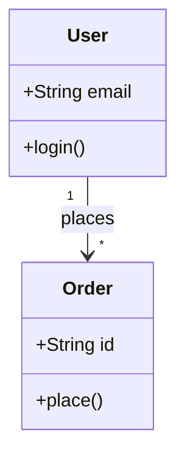
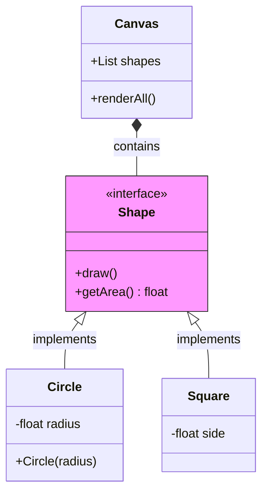
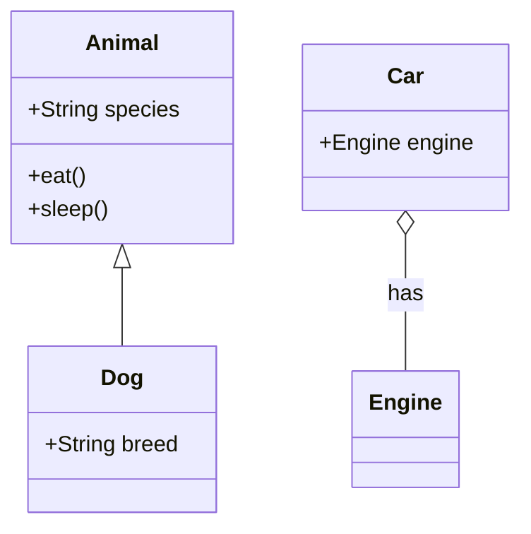
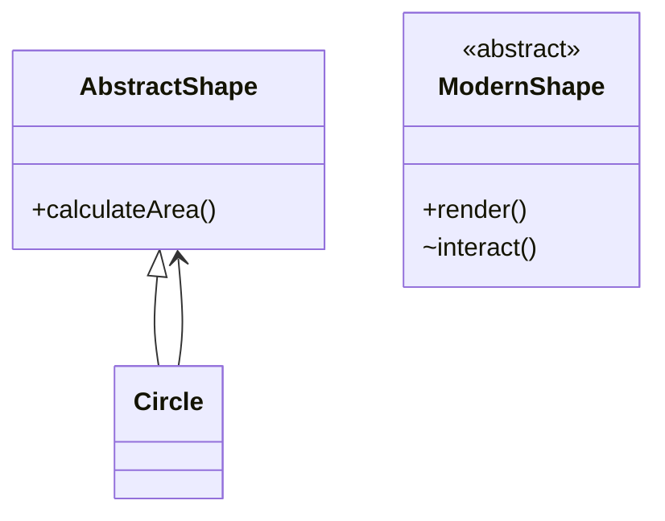
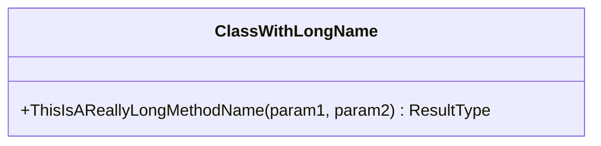
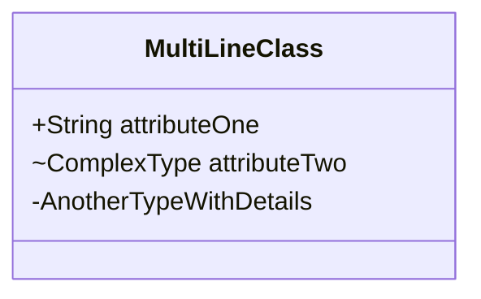
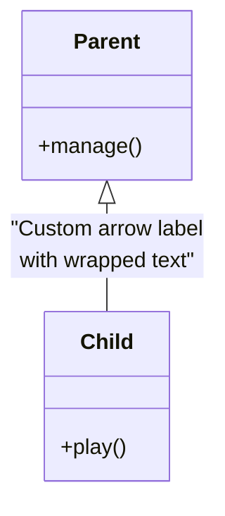

# Class Diagram

## When to Use
- Static structure, data models, and object-oriented design.
- Inheritance, composition, and member definitions.
- Documenting software architecture and class relationships.

## Syntax Reference

### Basic Example

### Extended Example (with styling)

### New Rendered Examples
#### Example 1: Inheritance and Composition

#### Example 2: Multi-line Attributes and Abstract Interfaces

### Edge-Case Examples
#### Long Labels

#### Multi-line Attributes

Note: Line breaks (` `, ` `, `\n`) do **not** work inside class members — they render as literal text. Keep member signatures concise.

#### Relationships with Special Labels

## All Supported Syntax
- **Keyword**: `classDiagram`.
- **Members/Methods**: `+` Public, `-` Private, `#` Protected, `~` Package/Internal. Syntax: `Type name` or `name() Type`.
- **Stereotypes**: `<<interface>>`, `<<abstract>>`, `<<service>>`.
- **Relationship Types**:
    - `<|--` Inheritance
    - `*--` Composition
    - `o--` Aggregation
    - `-->` Association
    - `--` Link (Solid)
    - `..>` Dependency
    - `..|>` Realization
- **Multiplicity**: `"1"`, `"0..1"`, `"1..*"`, `"*"` or `"many"`.
- **Namespaces**: `namespace Name { ... }`.
- **Styling**: `style ClassName fill:#color`.

## Layout Tips (type-specific)
- Declare the most-connected class first to help the layout engine.
- Group subclasses immediately after their superclass to keep the inheritance tree clean.
- Use multiplicity labels to clarify business logic constraints.
- **Line breaks**: ` ` works in relationship labels (e.g., `Parent <|-- Child : "line1 line2"`). Line breaks do **not** work inside class members (attributes/methods) — they render as literal text. `\n` does not work anywhere.

## Common Pitfalls
- Relationship syntax is very strict (e.g., `<|--` vs `<--`).
- Auto-layout can become messy with many classes; use namespaces to group them.
- `classDef` is not supported; use `style` for coloring.

## classDef Support
No. Use `style` instead for individual classes.