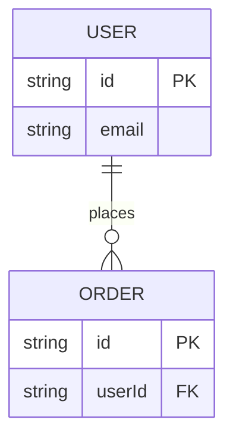
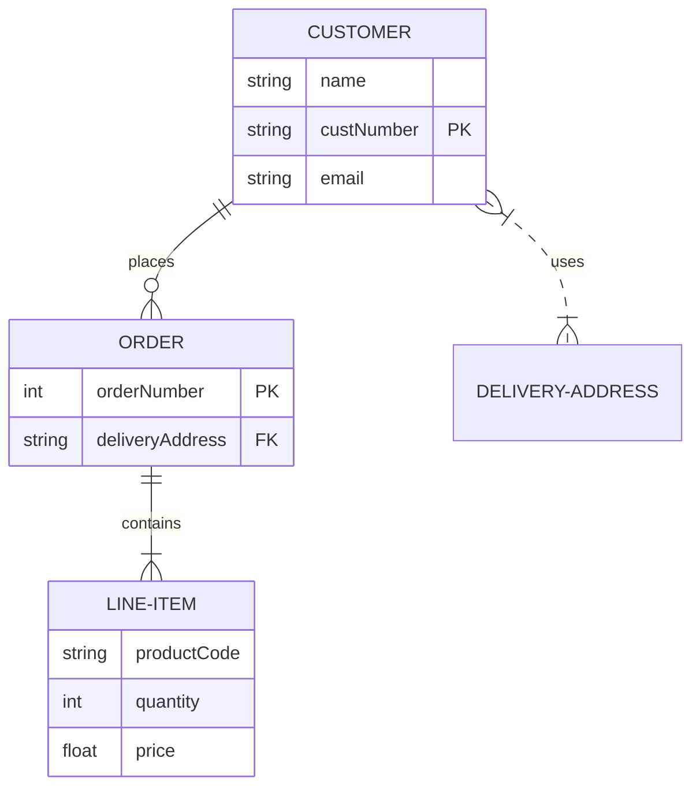
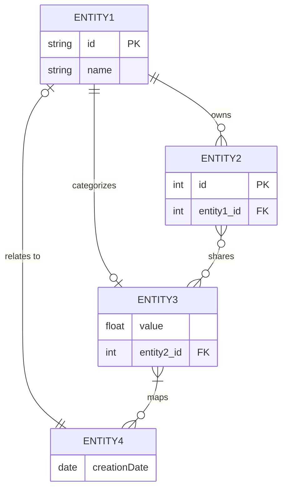
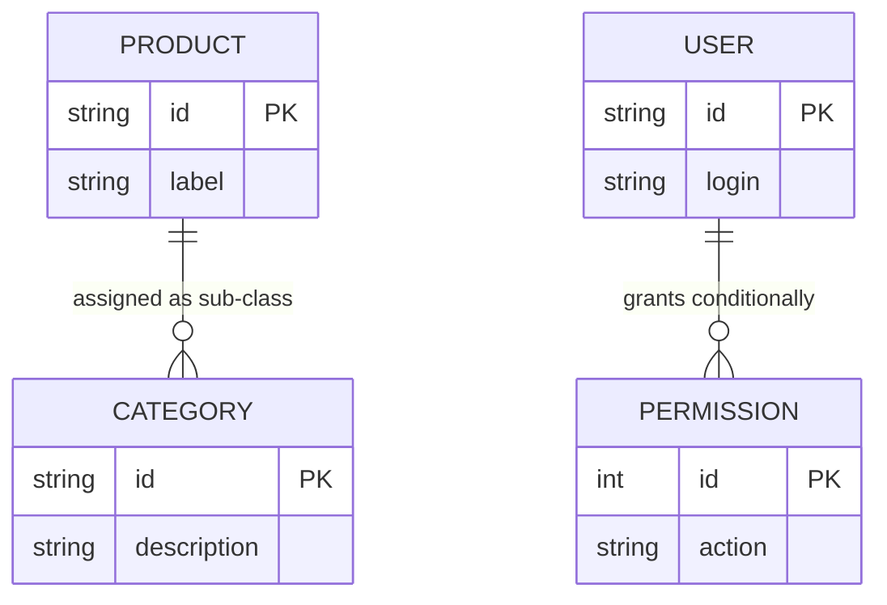

# ER Diagram

## When to Use
- Database schema design and entity relationship mapping.
- Primary/foreign key structures and cardinalities.
- Data modeling and structural documentation of data stores.

## Syntax Reference

### Basic Example

### Extended Example (with styling)

### Edge-Case Examples
#### Highly Connected Entities

#### Long Relationship Descriptions
ER relationship labels have inconsistent ` ` support across renderers — works in mmdc CLI but fails in IntelliJ's Mermaid plugin (renders literal ` `). Keep labels short and single-line for maximum compatibility.

## All Supported Syntax

- **Keyword**: `erDiagram`.
- **Entity Block**: `ENTITY { type name [key] }`.
- **Data Types**: `string`, `int`, `float`, `boolean`, `date`, `datetime`.
- **Keys**: `PK` (Primary Key), `FK` (Foreign Key), `UK` (Unique Key).
- **Relationship Syntax**:
    - `||--||` One-to-one
    - `||--o{` One-to-many (zero or more)
    - `||--|{` One-to-many (one or more)
    - `}o--o{` Many-to-many (zero or more)
    - `}|..|{` Many-to-many (one or more)
- **Relationship Style**:
    - `--` Solid line (identifying relationship)
    - `..` Dotted line (non-identifying relationship)
- **Relationship Label**: `ENTITY1 }|--|{ ENTITY2 : "label"`.

## Layout Tips (type-specific)
- Declare the entity with the most relationships first to help the layout engine center it.
- Declare each related entity immediately following the relation that introduces it — this helps the layout engine place connected entities adjacent to each other.
- Chain related entities outward from the center.
- Capitalize entity names by convention to improve readability.
- **Line breaks**: ER relationship labels have inconsistent ` ` support across renderers (works in mmdc CLI but fails in IntelliJ). Keep labels short and single-line for maximum compatibility. ` ` works in entity attribute comments but not in entity names. `\n` does **not** work anywhere — it renders as literal text.

## Common Pitfalls
- Cardinality syntax is very specific and can be hard to remember.
- Relation lines can cross frequently; order declarations to minimize this.
- Ensure all foreign keys correctly point to the intended primary keys.

## classDef Support
No.