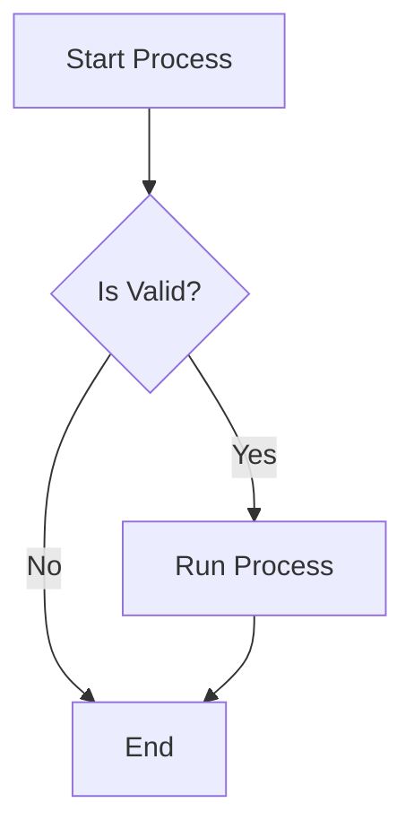
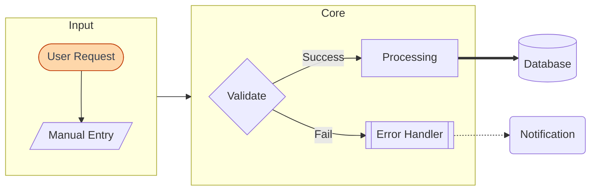
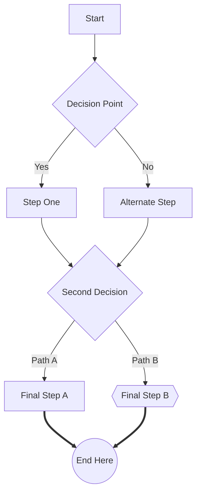
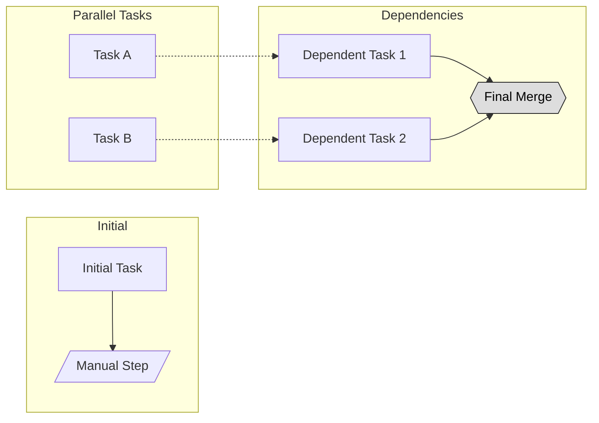

# Flowchart

## When to Use
- Logic branching and multi-step processes.
- Complex dependency maps and decision-tree logic.
- Visualizing parallel paths and system workflows.

## Syntax Reference

### Basic Example

### Extended Example (with styling)

### Edge-Case Examples
#### Dense Multi-step Process

#### Complex Dependencies

## All Supported Syntax

- **Direction**: `graph TD` (top-down), `graph LR` (left-right), `graph BT` (bottom-top), `graph RL` (right-left).
- **Keyword**: `flowchart` is preferred for modern features.
- **Node Shapes**:
    - `[Rectangle]`
    - `(Rounded)`
    - `([Stadium])`
    - `[[Subroutine]]`
    - `[(Database)]`
    - `((Circle))`
    - `>Flag]`
    - `{Decision}`
    - `{{Hexagon}}`
    - `[/Parallelogram/]`
    - `[\Backslashed\]`
    - `[/Trapezoid\]`

### Node Shape Quick Reference

| Syntax | Shape | Use For |
|--------|-------|---------|
| `[text]` | Rectangle | Process, action, component, step |
| `(text)` | Rounded rectangle | Softer process, intermediate step |
| `((text))` | Circle | Start/end point, event, trigger |
| `{text}` | Diamond (rhombus) | Decision, condition, branch |
| `([text])` | Stadium/pill | External system, service, API |
| `[[text]]` | Subroutine | Reusable component, function call |
| `>text]` | Asymmetric | Note, annotation, flag |
| `{{text}}` | Hexagon | Preparation step, configuration |
| `[/text/]` | Parallelogram | Input/Output |
| `[\text\]` | Alt parallelogram | Output (reversed slant) |
| `[/text\]` | Trapezoid | Manual operation |

- **Edges**:
    - `-->` Arrow
    - `---` Line
    - `-.->` Dotted arrow
    - `==>` Thick arrow
    - `-- text -->` Arrow with text
    - `---| text |-->` Arrow with text (alternative)
- **Subgraphs**: `subgraph Title` ... `end`. Can include `direction`.
- **Styling**: `classDef className style` and `class nodeID className` or `nodeID:::className`.

## Layout Tips (type-specific)
- Prefer `LR` for wide graphs with many parallel paths to reduce scrolling.
- Use `TD` for sequential, step-by-step processes.
- Use `subgraph` direction to mix layouts (e.g., a `TB` subgraph inside an `LR` graph).
- Reduce fan-out: split any node with 5+ outgoing edges into a dispatcher → handlers group.
- When crossings persist, try switching the global orientation (`graph TD` ↔ `graph LR`).
- **Line breaks**: Use ` ` in node labels, edge labels, and subgraph titles. `\n` does **not** work — it renders as literal text.

## Common Pitfalls
- Special characters in labels (like `(` or `]`) require quoting: `["Label (text)"]`.
- Do not mix `graph` and `flowchart` keywords in the same block.
- Excessive edge crossings in `TD` graphs can often be fixed by switching to `LR`.

## classDef Support
Yes. Full CSS-like styling for nodes using `classDef`.