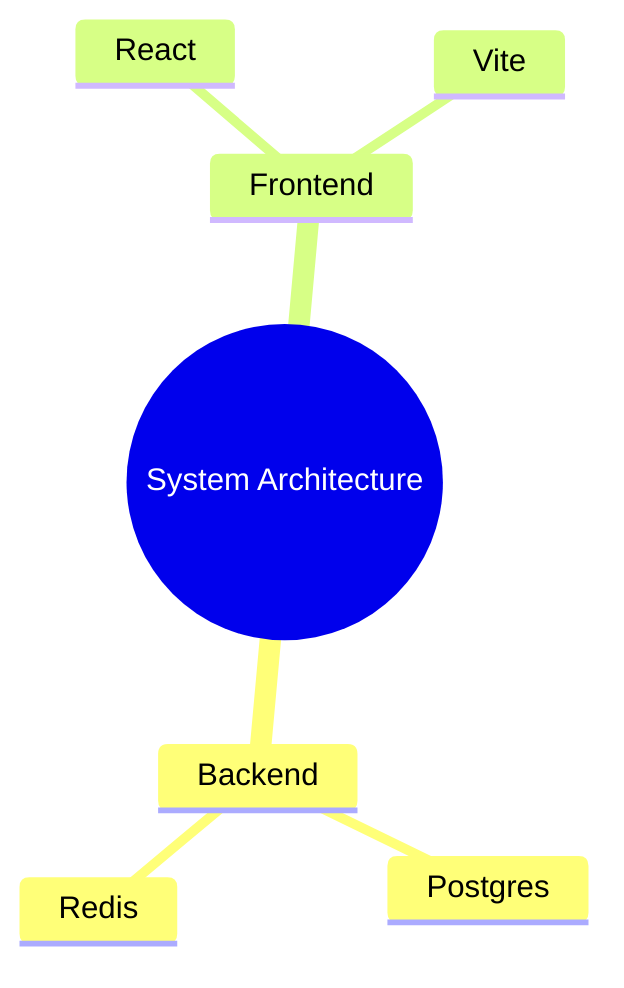
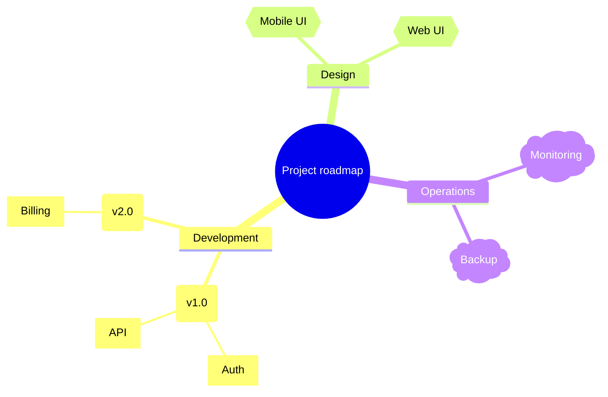

# Mindmap

## When to Use
- Brainstorming, information hierarchy, and breaking down features.
- Non-linear structures where one central node radiates outward.
- Conceptual mapping and high-level project organization.

## Syntax Reference

### Basic Example

### Extended Example (with styling)

## All Supported Syntax

- **Keyword**: `mindmap`.
- **Indentation**: Hierarchy is determined by leading spaces or tabs (be consistent).
- **Node Shapes**:
    - `((circle))`
    - `[square]`
    - `(rounded)`
    - `{{hexagon}}`
    - `))cloud((`
    - `>asymmetric]`
- **Icons**: `::icon(fa fa-name)` for FontAwesome icons.
- **Styling**: `:::className` for individual nodes (requires class definitions in Mermaid config).
- **Multiple Root Nodes**: Only one root node per diagram is supported.

## Layout Tips (type-specific)
- Mindmaps radiate from the center; the engine automatically balances children across quadrants.
- Declaration order influences which side children appear on; if a mindmap feels unbalanced, try reordering the first-level branches.
- Keep branch names short and use child nodes for detail to prevent visual clutter.
- **Line breaks**: Use ` ` in node labels to split long text across lines. `\n` does **not** work — it renders as literal text.

## Common Pitfalls
- Structure is strictly indentation-based; mixing tabs and spaces will break the diagram.
- Only one root node allowed.
- Limited internal styling compared to flowcharts.

## classDef Support
Beta support. Use `:::className` on a node and define the class in the Mermaid configuration if possible, though it's less standard than in flowcharts.
