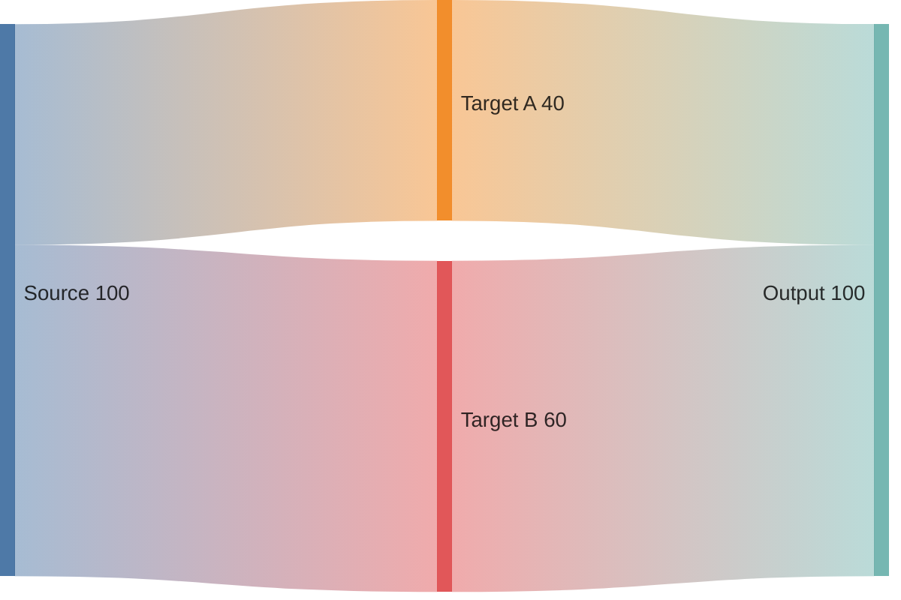
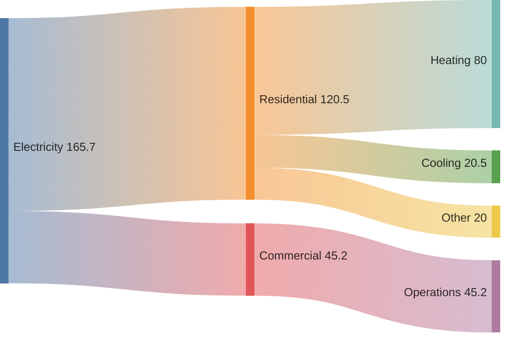

# Sankey Diagram

## When to Use
- Resource allocation, energy flow, or user conversion funnels.
- Visualizing how a total value is distributed across different stages.
- Proportional flow analysis and system efficiency tracking.

## Syntax Reference

### Basic Example

### Extended Example (with styling)

## All Supported Syntax

- **Keyword**: `sankey-beta`.
- **Data Format**: CSV row format: `Source,Target,Value`.
- **Values**: Must be numeric (integers or decimals).
- **Styling**: Extremely limited. No native `classDef` or `style` support in the beta version.
- **Labels**: Node names are used for labels.

## Layout Tips (type-specific)
- Order source nodes by total flow volume (largest first) to create a cleaner top-to-bottom visual hierarchy.
- The engine handles the complex proportional scaling and layout automatically.
- Keep source/target names concise as they are used as node labels.
- **Line breaks**: Line breaks (` `, ` `, `\n`) do **not** work in Sankey labels — they render as literal text. Keep node names short and single-line.

## Common Pitfalls
- Requires the `sankey-beta` keyword as it is a beta feature.
- No support for labels on the flows themselves, only on nodes.
- Values represent proportions rather than absolute units unless explicitly labeled in the node names.

## classDef Support
No.
