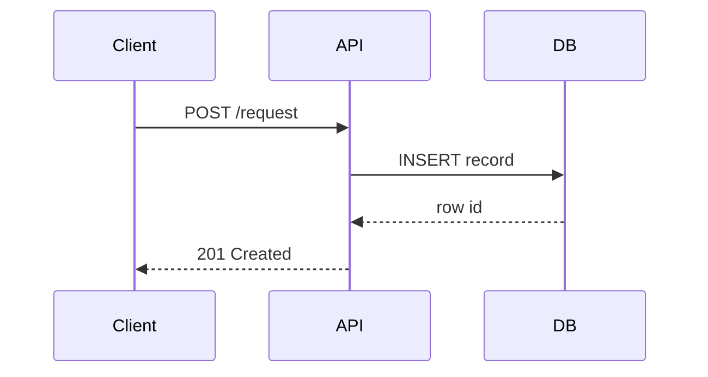
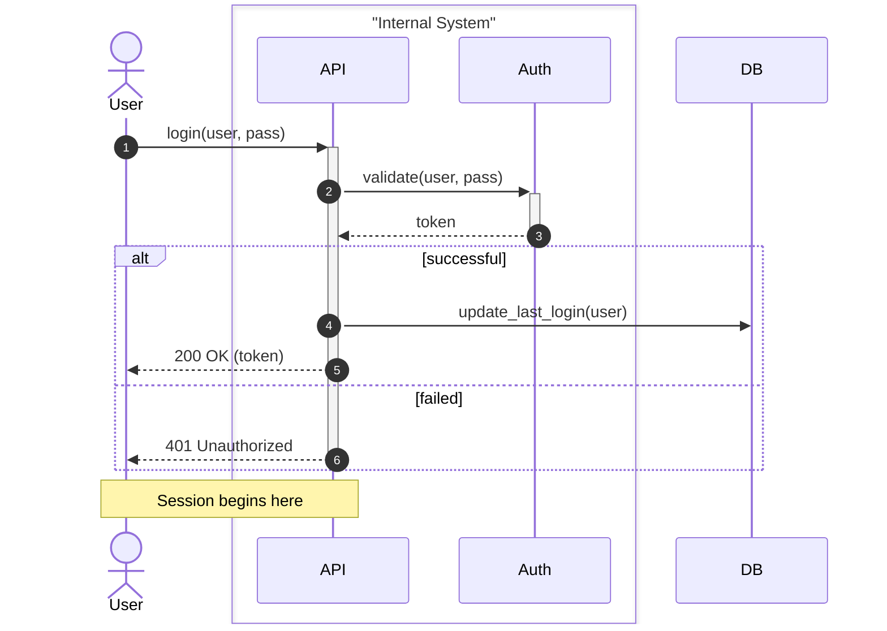
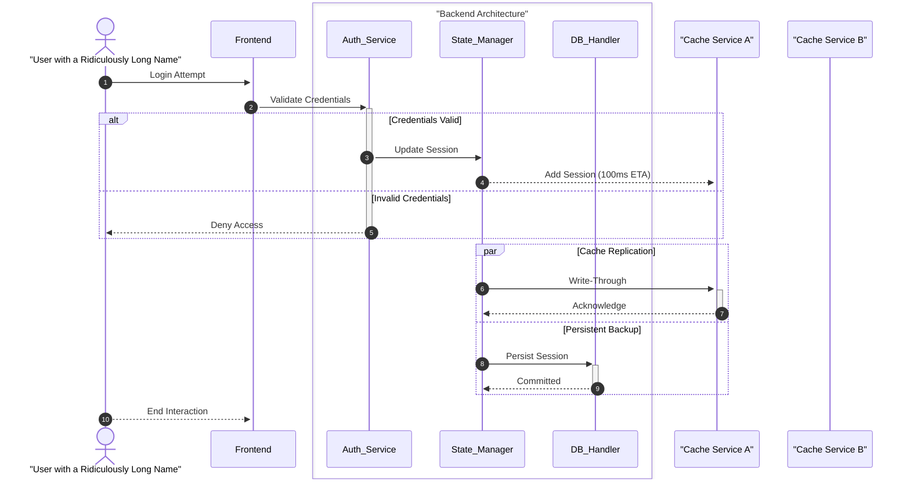
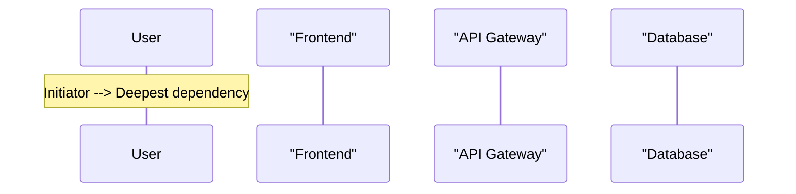
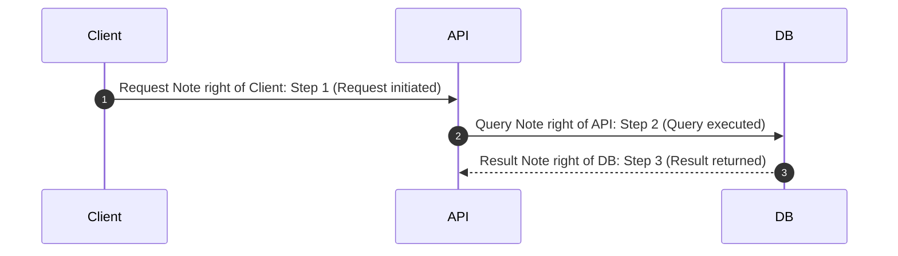

# Sequence Diagram

## When to Use
- Technical interaction flows between distinct components or services.
- API requests, authentication flows, and message passing between entities.
- Illustrating the chronological order of messages/interactions.
- Consider (potential) parallelism.

## Syntax Reference

### Basic Example

### Extended Example (with styling)

### Edge Case: Nested Blocks + Heavy Participants

## All Supported Syntax

- **Keywords**: `sequenceDiagram`, `autonumber`.
- **Participants**: `participant Name`, `actor Name`. Use `as` for aliases: `participant A as API`.
- **Arrows**:
    - `->` Solid line (no arrow)
    - `-->` Dotted line (no arrow)
    - `->>` Solid line with arrowhead
    - `-->>` Dotted line with arrowhead
    - `-x` Solid line with crosshead
    - `--x` Dotted line with crosshead
    - `-)` Solid line with open arrow
    - `--)` Dotted line with open arrow
- **Activation**: `activate participant`, `deactivate participant` or use `+`/`-` suffix on arrow: `A->>+B: call`.
- **Notes**: `Note right of`, `Note left of`, `Note over`.
- **Blocks**:
    - `loop` ... `end`
    - `alt` ... `else` ... `end`
    - `opt` ... `end`
    - `par` ... `and` ... `end`
    - `critical` ... `option` ... `end`
    - `break` ... `end`
    - `rect color` ... `end` (background color)
- **Boxes**: `box "Label" color` ... `end`.
- **Line breaks**: Use ` ` in quoted participant names, messages, and notes. `\n` does **not** work — it renders as literal text.

## Layout Tips (type-specific)

### Participant Ordering (THE primary layout lever)

Sequence diagrams are **crossing-free by construction** — the only layout decision you control is the left-to-right column order of participants. This single choice determines whether the diagram reads cleanly or forces the eye to zigzag.

**Rule: Declare participants in order of first interaction, from initiator to final responder.**

Typical pattern: `User → Frontend → API Gateway → Service → Database`

If you skip declaration order, Mermaid assigns columns by first appearance in message lines — which often produces a worse layout. **Always declare participants explicitly at the top.**

### Autonumber (always use for technical flows)

`autonumber` adds sequential step numbers to every message arrow. This is not decoration — it makes the diagram **referenceable in prose**.

Without autonumber, discussing the diagram requires awkward descriptions ("the arrow from API to DB"). With it, you write: "At step 2, the API queries the database." Always include `autonumber` unless the diagram has fewer than 3 messages.

### Activation Bars and alt/else

- Use `+`/`-` suffixes on arrows for activation: `A->>+B: call` activates B, `B-->>-A: response` deactivates B.
- **Never deactivate a participant inside both branches of an `alt`/`else` block.** Mermaid tracks activations linearly — deactivating in both paths causes "inactivate an inactive participant" errors. Instead, keep activations within a single branch or outside the `alt` block entirely.

## Common Pitfalls

- **Omitting participant declarations** — Mermaid will infer column order from first message appearance, which usually produces a worse layout than explicit declaration.
- **Redefining participants mid-flow** — Declare all participants at the top; don't re-declare after messages have started.
- **Conditional deactivation** — Using `-` deactivation inside both `alt` and `else` branches causes "inactive participant" errors. Deactivate outside the block or only in one branch.
- **Over-nesting** — Complex loops and opt blocks stacked 3+ deep become unreadable. Split into separate diagrams.
- **Missing `autonumber`** — Technical flows without step numbers are hard to reference in surrounding documentation.
- **Using `\n` for line breaks** — Always use ` ` instead. `\n` renders as literal text in participant names, messages, and notes.
- **Clipping or Overlapping Notes** — Placing notes in wide scenarios can result in notes being clipped or misaligned; try positioning them over participants.

## classDef Support
No. Minimal styling via `Note`, `rect`, and `box`.
