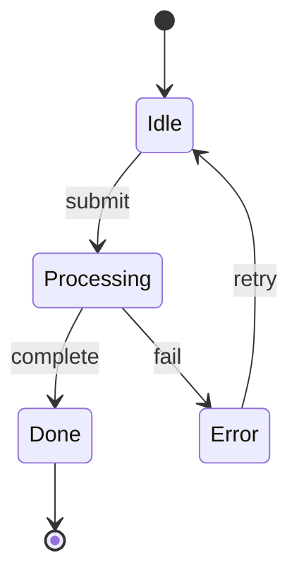
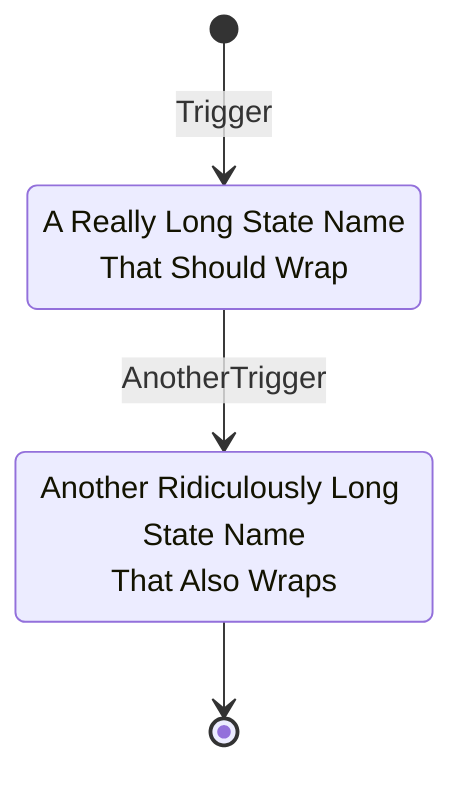
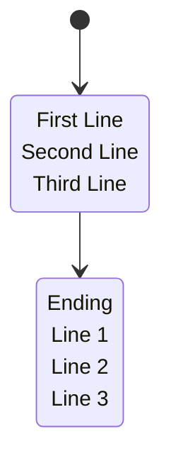
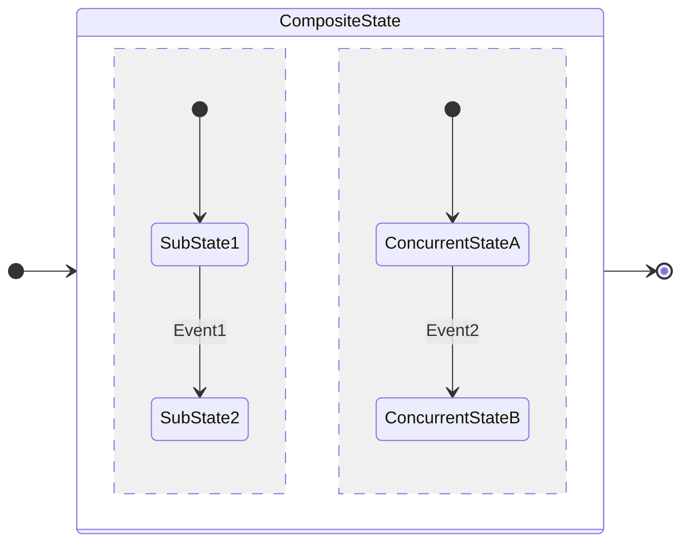
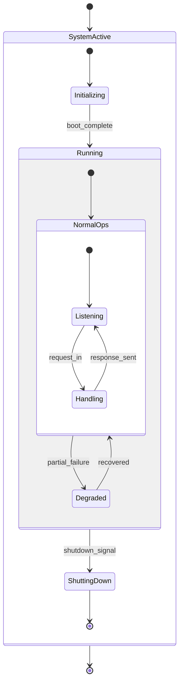
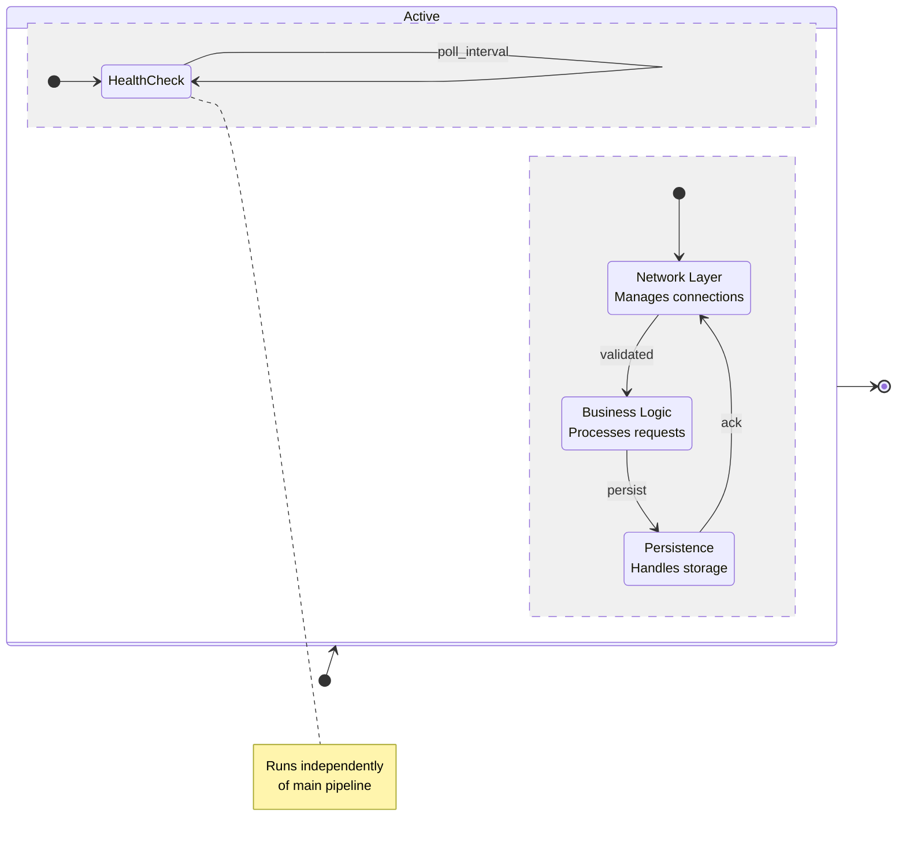

# State Diagram

## When to Use
- Modeling object lifecycle or system states.
- Showing valid transitions between states.
- Concurrent / parallel state regions.
- Nested (composite) state machines.

## Syntax Reference

### Basic Example

### Long Labels (use ` ` for line breaks)

### Multi-Line State Values

### Composite and Concurrent States

### Edge Case: Deeply Nested Composite States

### Edge Case: Concurrent Regions with Dense Transitions

## All Supported Syntax

- **Keyword**: `stateDiagram-v2` (always use v2).
- **States**: Plain `StateName` or aliased `state "Description" as Alias`.
- **Transitions**: `StateA --> StateB : label`.
- **Start/End**: `[*]` for both initial and final pseudo-states.
- **Composite**: `state Parent { ... }` with nested states inside.
- **Concurrent regions**: `--` separator inside a composite state.
- **Direction**: `direction LR` or `direction TB` (inside composite states too).
- **Choice**: `state choice <<choice>>` for conditional branching.
- **Fork/Join**: `state fork <<fork>>` and `state join <<join>>`.
- **Notes**: `note right of State : text` or `note left of State : text`.
- **Line breaks**: Use ` ` inside quoted state descriptions. `\n` does **not** work — it renders as literal text.

## Layout Tips (type-specific)
- Use `direction LR` for wide, shallow machines; `direction TB` (default) for deep ones.
- Declare states in transition order to help the layout engine.
- Keep composite states to 2 nesting levels max — beyond that, split into separate diagrams.
- Concurrent regions (`--`) work best with 2 regions; 3+ can produce cramped layouts.

## Common Pitfalls
- **Using `\n` for line breaks** — Always use ` ` in quoted state descriptions. `\n` renders as literal text.
- **Missing `end` or `}`** — Every composite state `state Name { ... }` needs its closing brace.
- **Mixing v1 and v2 syntax** — Always use `stateDiagram-v2`. The v1 syntax lacks features and has layout quirks.
- **Over-nesting composites** — 3+ nesting levels become unreadable. Split into separate diagrams.
- **Concurrent region overuse** — More than 2 concurrent regions in one composite state produces cramped layouts.

## classDef Support
Limited. `classDef` can style states in v2: `classDef myStyle fill:#f9f,stroke:#333` then `StateName:::myStyle`.
