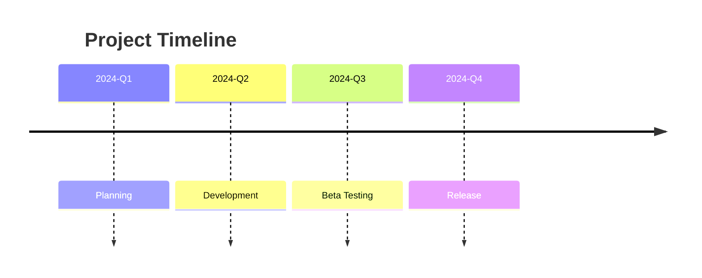
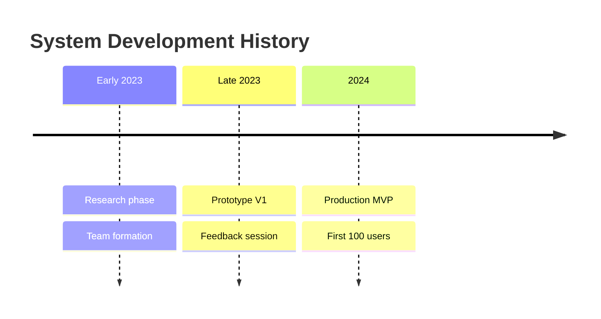

# Timeline Diagram

## When to Use
- Roadmaps, release history, and chronological event logs.
- Linear time progression without complex branching.
- High-level project milestones and historical documentation.

## Syntax Reference

### Basic Example

### Extended Example (with styling)

## All Supported Syntax

- **Keyword**: `timeline`.
- **Title**: `title Text`.
- **Sections**: Use plain text before a colon (e.g., `2024 :`).
- **Events**: Indented text after the colon. Multiple events can be listed for the same time period.
- **Styling**: Extremely limited. No native `classDef` support.

## Layout Tips (type-specific)
- Horizontal layout is fixed by the renderer.
- Use section groupings to keep the timeline readable if there are many events.
- Keep event descriptions short and punchy; long text will wrap and may clutter the layout.
- **Line breaks**: Use ` ` in section titles and event text. Prefer ` ` over ` ` — the self-closing form fails in some timeline contexts. `\n` does **not** work — it renders as literal text.

## Common Pitfalls
- Time periods (labels) are free-form text and are NOT parsed as date objects.
- Designed for simple linear progression; cannot handle branching or parallel timelines.
- No real layout control beyond the order of declaration.

## classDef Support
No.
